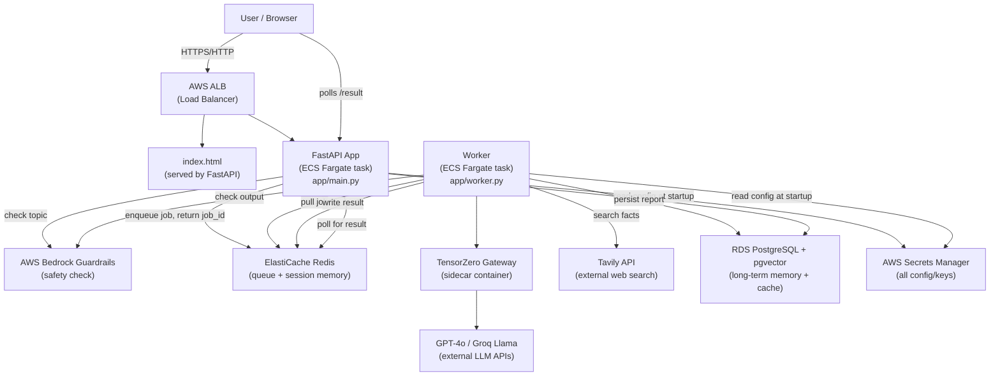
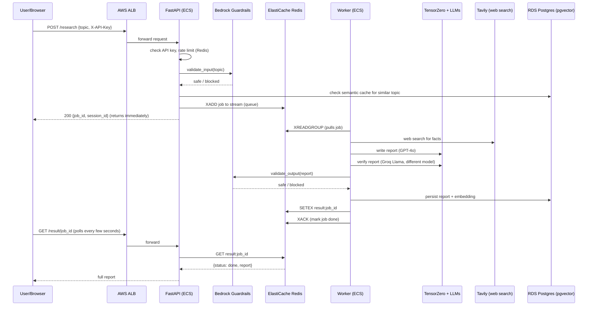
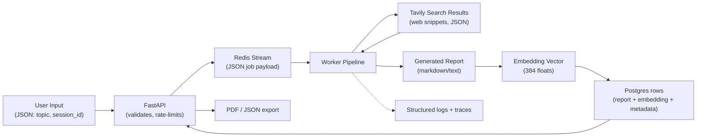
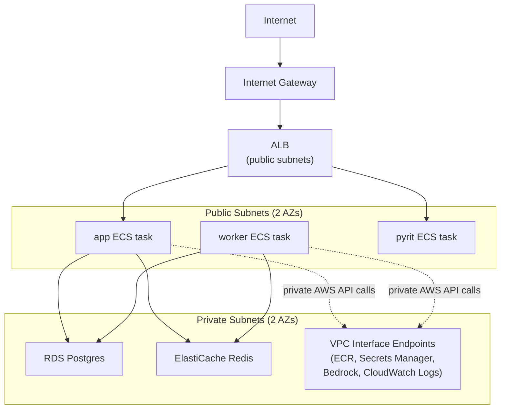
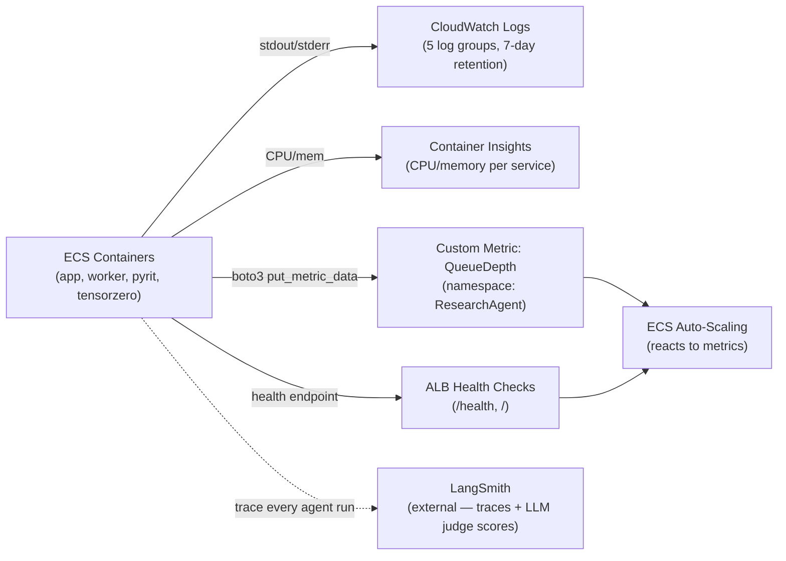
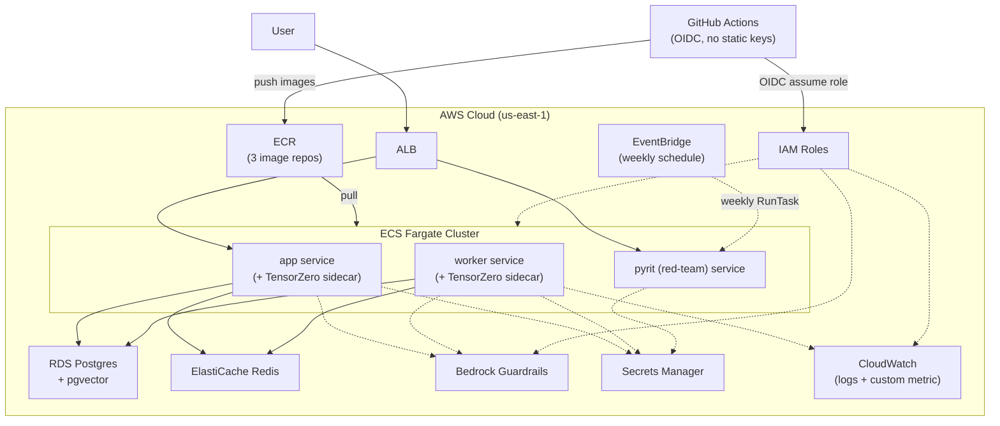

# How AWS Works in This Project

**Project:** Autonomous Research Agent (this repo — folder name "Multi-Agent AI Research Platform")
**Inspected:** README.md, `terraform/main.tf`, `.github/workflows/deploy.yml`, `app/*.py`, `app/Dockerfile`, `redteam_harness/Dockerfile`, `tensorzero/Dockerfile`, `bootstrap.sh`, `requirements.txt`. No `.env` file exists in this repo — confirmed by directory listing.

---

## 1. AWS Services Inventory — What's Actually Used

| Service | Used? | Where | Why |
|---|---|---|---|
| **VPC + Subnets** | ✅ | `terraform/main.tf:159-210` | Private network for everything |
| **VPC Endpoints** | ✅ | `terraform/main.tf:214-264` | Let private-subnet tasks reach AWS services without a NAT Gateway |
| **Security Groups** | ✅ | `terraform/main.tf:268-348` | Firewall rules between ALB, ECS tasks, Redis, RDS |
| **ECS (Fargate)** | ✅ | `terraform/main.tf:622-996` | Runs the app, worker, and red-team containers — no servers to manage |
| **ECR** | ✅ | `terraform/main.tf:1074-1093` | Stores the 3 Docker images (app, pyrit/red-team, tensorzero) |
| **ALB (Elastic Load Balancer)** | ✅ | `terraform/main.tf:520-620` | Routes internet traffic to the right ECS task |
| **RDS (PostgreSQL + pgvector)** | ✅ | `terraform/main.tf:489-516`, `app/pool.py`, `app/memory.py`, `app/cache.py` | Long-term memory + semantic cache, both vector-indexed |
| **ElastiCache (Redis)** | ✅ | `terraform/main.tf:449-480`, `app/queue.py`, `app/memory.py` | Job queue (Redis Streams) + session memory + rate limiting |
| **Bedrock Guardrails** | ✅ | `terraform/main.tf:352-445`, `app/guardrails.py` | Blocks harmful input/output automatically |
| **Secrets Manager** | ✅ | `terraform/main.tf:736-806`, `app/config.py` | Single source of truth for all API keys, DB URLs, tuning knobs |
| **IAM (roles + policies)** | ✅ | `terraform/main.tf:632-707`, `1117-1148`, `1162-1232` | Every service/human is given only the permissions it needs |
| **CloudWatch (Logs + custom metrics)** | ✅ | `terraform/main.tf:709-732`, `app/worker.py:142-159` | Container logs + the worker's self-published `QueueDepth` metric |
| **EventBridge** | ✅ | `terraform/main.tf:1097-1148` | Fires the red-team harness automatically every Monday 2am UTC |
| **GitHub OIDC (IAM Identity Provider)** | ✅ | `terraform/main.tf:1150-1232`, `.github/workflows/deploy.yml:70-74` | Lets GitHub Actions authenticate to AWS with **zero stored AWS keys** |
| **S3** | ✅ (infra-only) | `terraform/main.tf:1-23`, `bootstrap.sh` | Stores Terraform's *own* state file — not app data. Also has a VPC Gateway Endpoint for private ECR image-layer pulls. |
| **DynamoDB** | ✅ (infra-only) | `bootstrap.sh:38-44`, `terraform/main.tf:20` | Terraform state **lock** table only — prevents two people running `terraform apply` at once. **Not used as an application database anywhere.** |
| EC2 | ❌ Not present | — | ECS Fargate replaces it — no EC2 instances are provisioned |
| EKS / Kubernetes | ❌ Not present | — | No `k8s/` manifests, no `kubectl`, no cluster resources in Terraform |
| Lambda | ❌ Not present | — | Everything runs as long-lived ECS Fargate tasks instead |
| DynamoDB (as app DB) | ❌ Not present | — | Postgres/RDS is the only application database |
| CloudFront | ❌ Not present | — | The frontend (`index.html`) is served straight from the FastAPI app via the ALB, no CDN |
| Route 53 | ❌ Not present | — | No custom domain — users hit the ALB's raw AWS DNS name |
| API Gateway | ❌ Not present | — | The ALB is the only entry point; FastAPI handles routing itself |
| Cognito | ❌ Not present | — | Auth is a single static API key header (`app/auth.py`), not a user-identity service |
| SQS / SNS | ❌ Not present | — | Redis Streams (`app/queue.py`) does the job-queue role SQS would normally play — see "Architecture Decisions" in the README for why |

---

## 2. What Happens When a User Uses This App — Plain-English First

A person opens a web page (`index.html`) served by the FastAPI app, types a research topic, and clicks "Start Research." The FastAPI app **doesn't do the research itself** — it just writes the job into a Redis queue and hands the browser a `job_id` immediately. A **separate** background process (the Worker) is constantly watching that queue; it picks up the job, runs a 4-step AI pipeline (search the web → summarize → write a report → have a second, different AI double-check it), checks the input and output against AWS's safety filter, saves the finished report to a database, and writes the result back into Redis. Meanwhile the browser keeps asking "is it done yet?" every few seconds until it sees the finished report.



### Components, in easy words

- **User / Browser** — anyone with the ALB's web address.
- **AWS ALB** — a traffic cop AWS runs for you; it receives every request from the internet and forwards it to whichever running container is healthy.
- **FastAPI App** — the "front desk." It only accepts requests, checks the API key, checks the topic isn't harmful, and puts the job in line. It never does the actual AI work itself.
- **AWS Bedrock Guardrails** — a managed AWS service that reads text and says "this is safe" or "this is not" — used on both the user's input and the AI's output.
- **ElastiCache Redis** — a very fast in-memory database used two ways here: (1) as the job queue (using a Redis feature called Streams) and (2) as short-term conversation memory.
- **Worker** — a second, independent copy of the app running as its own container, whose only job is to pull items off the queue and do the actual multi-step AI research.
- **TensorZero Gateway** — a small proxy that decides which AI model handles a given request (and falls back to a second model if the first one is down).
- **RDS PostgreSQL (pgvector)** — the permanent database. `pgvector` lets Postgres also store and search AI "embeddings" (numeric fingerprints of text), which is how the semantic cache and long-term memory find similar past topics.
- **AWS Secrets Manager** — the one place all passwords, database URLs, and API keys live. Nothing sensitive is hardcoded or in a `.env` file.

---

## 3. AWS From Zero — Just the Concepts This Project Needs

- **AWS** = a company (Amazon) that rents you computers, storage, databases, and other infrastructure by the hour/second instead of you buying physical servers.
- **Why this project uses it** — running Postgres, Redis, a load balancer, and 3 background services reliably by hand would mean managing real servers. AWS manages the "boring but critical" parts (patching, backups, encryption, scaling) so this project's code only has to focus on the AI pipeline.
- **AWS Region** — a physical cluster of AWS data centers in one geographic area. This project uses exactly one: `us-east-1` (Northern Virginia) — set in `terraform/main.tf:32`.
- **Availability Zone (AZ)** — a Region is split into multiple independent AZs (separate buildings/power/network) so one AZ failing doesn't take everything down. This project spreads its subnets across **2 AZs** (`terraform/main.tf:153`) but does **not** enable multi-AZ redundancy for RDS or Redis (`db_multi_az = false`, `multi_az_enabled = false`) — see Known Limitations in the README.
- **AWS Account** — the billing/ownership boundary. Everything here (ARNs like `arn:aws:iam::<account-id>:role/...`) lives inside one AWS account, identified in Terraform via `data.aws_caller_identity.current`.
- **IAM (Identity and Access Management)** — AWS's permission system: who (or what) is allowed to do what.
  - **IAM Role** — an identity a *service* (not a human) can assume temporarily. This project has 4: `ecs_task_execution` (lets ECS pull secrets/images), `ecs_task` (lets the running app call Bedrock/Secrets Manager/CloudWatch), `eventbridge_ecs` (lets the weekly scheduler launch a task), and `github_actions` (lets CI deploy).
  - **IAM User** — a permanent human/programmatic identity with long-lived credentials. **Not used here at all** for automation — this project deliberately avoids IAM Users for CI in favor of OIDC roles (see Security section). A human still needs an IAM identity to run `aws configure` once, but the repo doesn't manage that.
  - **IAM Policy** — the actual JSON document listing allowed actions/resources, attached to a role.
- **VPC (Virtual Private Cloud)** — your own private, isolated network inside AWS, `10.0.0.0/16` here (`terraform/main.tf:159`). Nothing outside it can see in except what you explicitly expose.
  - **Public subnet** — a subnet with a route to the Internet Gateway; resources here can be reached from (and reach) the internet. All 3 ECS services run here (`assign_public_ip = true`) — see Known Limitations for why that's not ideal.
  - **Private subnet** — no direct internet route. RDS, Redis, and the VPC Endpoints live here — the database is never directly reachable from the internet.
- **Security Group** — a virtual firewall attached to a resource, allowing traffic only from specific sources/ports. Example: the `rds` security group (`terraform/main.tf:339-348`) only allows port 5432 from the `ecs_tasks` security group — nothing else on Earth can even attempt to connect to the database.

---

## 4. Every AWS Service Used — Deep Dive

### AWS ECS (Fargate)

**What is it?** A "computer rented from AWS" that runs your Docker container, except you never see or manage the underlying server — Fargate is the serverless flavor of ECS.

**Why this project uses it:** It needs 3 always-on background processes (API, Worker, Red-Team harness) that hold long-lived connections (a database pool, a TensorZero sidecar connection) — a poor fit for Lambda's short-lived, cold-start model (explicitly called out as an Architecture Decision in the README).

**Where used:** `terraform/main.tf:624-996` defines the cluster, 3 task definitions (`app`, `pyrit`, `worker`), and 3 services.

**How it communicates:** Each ECS task gets an IP inside the VPC's public subnets. The `app` and `worker` task definitions each run **two containers** in one task: the Python app container plus a `tensorzero` sidecar container that they call over `localhost:3000` — no network hop needed. The ALB forwards HTTP traffic to the `app` and `pyrit` tasks on ports 8000/8001.

**Simple analogy:** Like ordering "a running app" from a menu instead of "a computer, then an OS, then Docker, then my app" — AWS handles everything below the container.

**If removed:** Nothing runs — there'd be no place for the FastAPI app, worker, or red-team harness to execute at all.

**Important config:** `app_cpu=2048` (2 vCPU), `app_memory=4096` (4GB) for app/worker; `256`/`512` for the lightweight red-team harness. Auto-scaling: app 1–5 tasks, worker 1–5 tasks.

---

### Amazon ECR (Elastic Container Registry)

**What is it?** Docker Hub, but private and run by AWS.

**Why this project uses it:** ECS needs to pull the built Docker images from *somewhere* — ECR is the AWS-native, IAM-integrated place to store them.

**Where used:** `terraform/main.tf:1074-1093` (3 repos: app, pyrit, tensorzero); pushed to by `.github/workflows/deploy.yml:82-101`.

**How it communicates:** GitHub Actions builds the image locally in the CI runner, then `docker push`es it to ECR over HTTPS (authenticated via the OIDC-assumed role). ECS Fargate then pulls from ECR through a **VPC Endpoint** (`aws_vpc_endpoint.ecr_dkr`/`ecr_api`), so the pull never leaves AWS's private network.

**Simple analogy:** A private warehouse for your shipping containers (literally — "container" registry).

**If removed:** GitHub Actions would have nowhere to push built images, and ECS would have nothing to pull — deployment breaks entirely.

**Important config:** `image_scanning_configuration { scan_on_push = true }` — every pushed image is automatically scanned for known vulnerabilities.

---

### Application Load Balancer (ALB)

**What is it?** A managed traffic router that sits in front of your app and spreads incoming requests across healthy containers.

**Why this project uses it:** With 1–5 app tasks and 1–5 worker-adjacent tasks scaling up/down, something needs a single stable address to send traffic to and to know which tasks are actually alive.

**Where used:** `terraform/main.tf:520-620`. Listens on port 80 (HTTP, forwards to the app) and port 8001 (forwards to the red-team dashboard); a separate listener rule (`aws_lb_listener_rule.pyrit_via_http`) also exposes the red-team's `/run-attacks`, `/results`, `/status` on port 80 for networks that block port 8001.

**How it communicates:** Health-checks each target's `/health` (app) or `/` (red-team) every 30s; only routes traffic to targets that pass 2 consecutive checks.

**Simple analogy:** A restaurant host who seats customers only at tables (containers) that are actually clean and staffed.

**If removed:** No stable URL for users to hit; ECS auto-scaling would also lose its request-count signal (`ALBRequestCountPerTarget`).

**Important config:** HTTPS is supported via `acm_certificate_arn` but is **not currently enabled** — this deployment runs on plain HTTP only, per the README's Known Limitations (no domain name to issue a certificate against).

---

### Amazon RDS (PostgreSQL) with pgvector

**What is it?** "A database you don't have to run yourself" — AWS manages the OS, patching, backups, and failover of a real Postgres instance for you.

**Why this project uses it:** Two jobs — (1) long-term memory of past reports and (2) a semantic cache that finds "have we researched something *similar* to this before?" — both need `pgvector`'s ability to store and nearest-neighbor-search 384-dimension embeddings, not just plain rows.

**Where used:** `terraform/main.tf:489-516` (the instance itself); `app/pool.py` (connection pooling via `asyncpg`); `app/memory.py` (`reports` table, `embedding vector(384)`); `app/cache.py` (`semantic_cache` table, same vector type).

**How it communicates:** The Worker and API both hold an `asyncpg` connection pool (2–10 connections, `app/pool.py`) opened using `DATABASE_URL` — pulled from Secrets Manager, never hardcoded. Only the `ecs_tasks` security group is allowed to reach port 5432 (`terraform/main.tf:339-348`) — the database has no public exposure whatsoever.

**Simple analogy:** RDS is like renting a fully-staffed filing room instead of buying filing cabinets and hiring your own janitor to maintain them.

**If removed:** No long-term memory across sessions, no semantic cache (every request would re-run the full, expensive pipeline), no report-diffing feature.

**Important config:** `storage_encrypted = true`, `deletion_protection = true` (a final snapshot is taken even on `terraform destroy`), `performance_insights_enabled = true`, engine `postgres 15.8`, instance class `db.t3.micro` (small/cheap by default), `multi_az = false` (single point of failure by default — see Known Limitations).

---

### Amazon ElastiCache (Redis)

**What is it?** A managed, in-memory (very fast) key-value data store, hosted the same "AWS manages the server" way as RDS.

**Why this project uses it:** Two roles at once — (1) the job queue between the API and Worker, using Redis's **Streams** feature (`XADD`/`XREADGROUP`/`XACK`/`XAUTOCLAIM`) for at-least-once delivery with consumer groups, and (2) short-lived session memory (last few messages per `session_id`) and per-IP rate-limit counters.

**Where used:** `terraform/main.tf:449-480`; `app/queue.py` (all the Streams logic); `app/memory.py` (session memory); `app/main.py:51-69` (`_rate_limit`, using Redis `INCR`/`EXPIRE`).

**How it communicates:** Both API and Worker connect over `rediss://` (TLS) using a random 32-character AUTH token generated by Terraform and injected via Secrets Manager — never as a plain-text environment variable in the task definition (called out explicitly in `terraform/main.tf:873-877`).

**Simple analogy:** A whiteboard everyone on the team can read and write to instantly — perfect for short-lived, fast-changing information, unlike the filing room (RDS) which is for permanent records.

**If removed:** No job queue at all — the API would have nowhere to hand off research jobs, and the Worker would have nothing to consume. The whole system stops functioning.

**Important config:** `transit_encryption_enabled = true`, `at_rest_encryption_enabled = true`, `auth_token` required to connect, `automatic_failover_enabled = false` and `multi_az_enabled = false` (single node — see Known Limitations).

---

### AWS Bedrock Guardrails

**What is it?** A managed, versioned content-safety filter — you configure rules (block hate speech, block PII, block prompt-injection attempts) once, and AWS applies them to any text you send it, without you having to build or host your own classifier.

**Why this project uses it:** So safety enforcement lives outside the application code that could itself be the thing bypassing it — it's independently auditable (an explicit Architecture Decision in the README).

**Where used:** `terraform/main.tf:352-445` (the guardrail's rules: blocks hate/violence/sexual/insults/misconduct content and detected prompt-injection at HIGH strength on both input and output; blocks SSNs, credit cards, and AWS access keys; anonymizes emails/phones; blocks profanity). Called from `app/guardrails.py` (`validate_input`/`validate_output`), used on the way in (`app/main.py`) and the way out (`app/worker.py`).

**How it communicates:** `app/guardrails.py` calls `boto3.client("bedrock-runtime").apply_guardrail(...)` — a direct HTTPS API call from inside the ECS task, routed privately through the `bedrock_runtime` VPC Endpoint (`terraform/main.tf:248-255`) rather than over the public internet.

**Simple analogy:** A security guard at both the entrance (input) and exit (output) of the building, checking bags both ways.

**If removed:** Nothing would stop a malicious topic from reaching the LLM pipeline, or a harmful LLM output from reaching the user — this is the project's only automated safety layer (see the README's red-team results for what this actually blocks/misses in practice).

**Important config:** `bedrock:ApplyGuardrail` IAM permission is scoped to just this one guardrail's ARN (`terraform/main.tf:686-689`), not `"*"`.

---

### AWS Secrets Manager

**What is it?** A managed vault for storing sensitive strings (passwords, API keys, connection URLs) — instead of putting them in code, `.env` files, or plain environment variables.

**Why this project uses it:** Every piece of config the app needs — 4 external API keys, the database URL, the Redis URL (which embeds its own auth token), the Bedrock Guardrail ID, and ~25 tuning parameters — all live in **one JSON secret**, `research-agent/config`, instead of scattered across files or GitHub secrets.

**Where used:** `terraform/main.tf:736-806` (creates the secret with all infra-derived values pre-filled); `app/config.py:1-19` (fetches and parses it once at process startup, cached with `@lru_cache`).

**How it communicates:** `app/config.py` calls `boto3.client("secretsmanager").get_secret_value(SecretId="research-agent/config")` once when the app or worker process starts. There is a test-only escape hatch (`RESEARCH_AGENT_CONFIG_JSON` env var) explicitly documented as "Never set in production."

**Simple analogy:** A safe-deposit box with a combination only specific, authorized people/services can open — instead of writing the combination on a sticky note (a `.env` file committed by accident, or a plaintext environment variable visible via `DescribeTaskDefinition`).

**If removed:** The app literally cannot start — `Config()` is built at import time in `app/main.py`, and without the secret there's no database URL, Redis URL, or Guardrail ID to use.

**Important config:** Four keys (`OPENAI_API_KEY`, `GROQ_API_KEY`, `LANGSMITH_API_KEY`, `TAVILY_API_KEY`) are deliberately **not** set by Terraform and must be added by hand — Terraform's `lifecycle { ignore_changes = [secret_string] }` (`terraform/main.tf:803-805`) exists specifically so a routine `terraform apply` never wipes those manually-entered keys back to blank (documented as a real incident that happened once).

---

### IAM (Roles & Policies)

**What is it?** AWS's permission system — see Section 3 for the concepts.

**Why this project uses it:** Every AWS-calling actor here — the ECS containers, the weekly scheduler, and GitHub's CI — needs *some* AWS permissions, and IAM is how those are scoped down to only what's needed (least privilege).

**Where used:** `terraform/main.tf:632-707` (ECS roles), `1117-1148` (EventBridge role), `1162-1232` (GitHub Actions role).

**How it communicates:** N/A — IAM isn't called directly by app code; it's the permission layer every other AWS API call is checked against.

**Simple analogy:** A building's keycard system — the cleaning crew's keycard opens every room (broad), but the API's own keycard only opens the specific database, the specific guardrail, and the metrics-publishing panel.

**If removed:** Every AWS API call in the app (`boto3.client(...)`) would fail with an access-denied error — Secrets Manager fetch, Bedrock Guardrail check, and CloudWatch metric publish would all break, effectively taking the whole app down.

**Important config:** The task role's Secrets Manager permission is scoped to `arn:...:secret:research-agent/*` (not every secret in the account); the Bedrock permission is scoped to one specific guardrail ARN.

---

### CloudWatch (Logs + Custom Metrics)

**What is it?** AWS's built-in logging and monitoring service.

**Why this project uses it:** Two jobs — (1) every container's stdout/stderr is captured automatically (the `awslogs` driver), and (2) the Worker publishes its own custom metric so autoscaling can react to the thing that actually matters (queue backlog), not a proxy like CPU.

**Where used:** `terraform/main.tf:709-732` (5 log groups: app, pyrit, tensorzero ×2, worker); `terraform/main.tf:1052-1070` (the autoscaling policy that consumes the custom metric); `app/worker.py:142-159` (`_publish_queue_depth_loop` — reads Redis `XLEN` every loop and calls `cloudwatch.put_metric_data`).

**How it communicates:** Log shipping is automatic (ECS's `awslogs` log driver, no app code involved). The custom metric is a direct `boto3.client("cloudwatch").put_metric_data(...)` call from inside the worker process, through the `cloudwatch_logs`/general CloudWatch VPC path.

**Simple analogy:** A building's security-camera system (logs, passive) plus a dashboard gauge the building itself updates in real time (the custom metric, active).

**If removed:** No historical logs to debug failures with, and worker autoscaling would have no signal to scale on (it would need to fall back to CPU-only scaling, or none at all).

**Important config:** `log_retention_days = 7` (short retention — cost control); Container Insights is enabled cluster-wide (`terraform/main.tf:626-629`) for richer per-service CPU/memory dashboards.

---

### Amazon EventBridge

**What is it?** AWS's managed cron/event-scheduler — "run this thing on this schedule" without you running your own cron server.

**Why this project uses it:** The red-team harness should run automatically on a regular cadence, not only when a human remembers to trigger it.

**Where used:** `terraform/main.tf:1097-1148` — a `cron(0 2 ? * MON *)` rule (every Monday, 2am UTC) that directly launches a new Fargate task from the `pyrit` task definition.

**How it communicates:** EventBridge calls `ecs:RunTask` directly (via the `eventbridge_ecs` IAM role) — no application code is involved in triggering it; the red-team container itself, once running, then makes normal HTTP calls to the ALB just like a manual run would.

**Simple analogy:** An alarm clock that doesn't just ring — it gets out of bed and starts the coffee maker itself.

**If removed:** The red-team harness would only ever run when someone manually triggers it via the API/dashboard — no automatic recurring safety check.

---

### GitHub OIDC Provider (IAM Identity Provider)

**What is it?** A trust relationship that lets GitHub Actions prove its identity to AWS cryptographically, so AWS can hand it temporary credentials — no AWS access key/secret ever has to be typed into GitHub.

**Why this project uses it:** Long-lived AWS keys stored as GitHub secrets are a classic leak vector (accidental logging, compromised repo, etc.) — OIDC eliminates that entirely.

**Where used:** `terraform/main.tf:1150-1232`; consumed in `.github/workflows/deploy.yml:70-74` (`aws-actions/configure-aws-credentials` with `role-to-assume`, no `aws-access-key-id` anywhere in the workflow).

**How it communicates:** On every workflow run, GitHub mints a short-lived signed JWT identifying the exact repo/branch; AWS's IAM OIDC provider verifies that JWT's signature against GitHub's public keys and, if the `sub` claim matches the trust policy's condition, issues temporary STS credentials scoped to the `github_actions` role.

**Simple analogy:** Instead of giving the delivery company a permanent key to your building, you verify their ID badge at the door every single time and hand them a visitor pass that expires in an hour.

**If removed:** CI would need a real AWS access key/secret stored as a GitHub secret instead — a permanently-valid credential sitting in a third-party system.

**Important config:** The trust policy's `StringLike` condition scopes the role to `repo:<owner>/<repo>...:ref:refs/heads/main` — a pull request from a fork of this repo **cannot** assume this role, so a malicious PR can't exfiltrate AWS credentials.

---

### Amazon S3 (infra-only, not app storage)

**What is it?** Amazon's object storage service — "an online storage room."

**Why this project uses it:** **Not** for anything the application does at runtime. It's used purely to hold Terraform's own **state file** (the JSON record of what infrastructure currently exists) — `bootstrap.sh` creates the bucket once, and `terraform/main.tf`'s `backend "s3" {}` block (lines 16-22) tells Terraform to read/write its state there instead of on a local disk (so multiple people/CI runs share one source of truth). There's also a VPC Gateway Endpoint to S3 (`terraform/main.tf:232-237`) so ECR image layers — which ECR stores in S3 under the hood — can be pulled privately.

**Where used:** `bootstrap.sh:11-36` (creates + secures the bucket); `terraform/main.tf:16-22` (backend config).

**Simple analogy:** A shared logbook the construction crew (Terraform) keeps in a locked drawer, not the building itself.

**If removed:** Terraform would lose track of what it already created — a very risky state to be in, but this doesn't affect the *running application* at all, since nothing at request-time touches this bucket.

**Important config:** Versioned, encrypted (AES256), and public access fully blocked (`bootstrap.sh:22-36`) — even though it holds no application secrets, the state file does contain sensitive values (e.g. the Redis auth token, DB password) in plaintext, so it's still locked down properly.

---

### Amazon DynamoDB (infra-only, not app storage)

**What is it?** A fully managed NoSQL key-value database.

**Why this project uses it:** Also **not** application data — it holds exactly one table, used by Terraform to acquire a **lock** while running `apply`/`destroy`, so two people (or a human + CI) can't corrupt the state file by running Terraform at the same time.

**Where used:** `bootstrap.sh:38-44` (creates the table); referenced as `dynamodb_table = "research-agent-tf-locks"` in `terraform/main.tf:20`.

**Simple analogy:** A "do not disturb, editing in progress" sign on the shared logbook from the S3 example above.

**If removed:** Two simultaneous `terraform apply` runs could race and corrupt the infrastructure's state record — but again, zero effect on the running app itself.

---

## 5. Complete Request Flow — Sequence Diagram



**Step 1 — Submit:** The browser POSTs the topic to `/research` with an `X-API-Key` header. The ALB routes it to a healthy FastAPI task.

**Step 2 — Guard the door:** FastAPI checks the API key (`app/auth.py`), enforces a per-IP rate limit using Redis `INCR`/`EXPIRE` (`app/main.py:51-69`), then sends the topic to Bedrock Guardrails for a safety check.

**Step 3 — Check the cache:** Before doing any expensive work, it checks Postgres/pgvector for a semantically similar past report.

**Step 4 — Queue and return immediately:** If nothing usable is cached, the job is pushed onto the Redis Stream (`XADD`) and the API responds right away with a `job_id` — the user isn't kept waiting on the full pipeline.

**Step 5 — Worker picks it up:** The independently-scaling Worker service (a separate ECS service, always polling via `XREADGROUP`) claims the job.

**Step 6 — The AI pipeline runs:** LangGraph's 4 nodes execute in order — Search (Tavily, the *only* allowed source of facts) → Summarize → Write (via TensorZero → GPT-4o, falling back to Groq Llama) → Verify (via TensorZero → Groq Llama specifically, a *different* model than the writer, so nothing grades its own work).

**Step 7 — Output safety check:** The finished report is sent through Bedrock Guardrails again, this time as `OUTPUT`.

**Step 8 — Persist and finish:** The report (plus its embedding) is saved to Postgres for long-term memory/future cache hits, the result is written to Redis with a TTL, and the message is acknowledged (`XACK`) so it's never redelivered.

**Step 9 — User sees the result:** The browser has been polling `/result/<job_id>` the whole time; once Redis has the result, the next poll returns it.

---

## 6. Deployment — From Laptop to AWS

```mermaid
flowchart LR
    Dev["Developer\n(local machine)"]
    GH["GitHub repo\n(push to main)"]
    Test["GitHub Actions:\ntest job\npytest + ruff +\nterraform validate"]
    Build["GitHub Actions:\nbuild-and-deploy job\n(only if test passes)"]
    OIDC["AWS STS\n(OIDC role assumption,\nno stored keys)"]
    ECRPush["docker buildx build --push\n→ 3 images to ECR"]
    TaskDef["Register new ECS\ntask definitions\n(jq-patched image URIs)"]
    ECSUpdate["ecs update-service\n--force-new-deployment\n(app, worker, pyrit)"]
    Live["Running on ECS Fargate\nbehind the ALB"]

    Dev -->|git push| GH
    GH --> Test
    Test -->|pass| Build
    Build --> OIDC
    OIDC --> ECRPush
    ECRPush --> TaskDef
    TaskDef --> ECSUpdate
    ECSUpdate --> Live
    ECSUpdate -->|"aws ecs wait services-stable"| Live
    Live -.->|"if it fails: roll back to OLD_TASK_DEF"| ECSUpdate
```



1. **I write code** — locally, in this repo.
2. **I push code** — `git push origin main`.
3. **What triggers?** — `.github/workflows/deploy.yml` fires on any push to `main` (or a manual `workflow_dispatch`).
4. **What CI/CD does first (the `test` job):** installs deps, runs `ruff check`, runs the full `pytest` suite with a **60% coverage gate** (`--cov-fail-under=60` — the build stops here if tests fail or coverage drops), then `terraform fmt -check` and `terraform validate`. **Nothing gets built or deployed if this job fails.**
5. **Is Docker built?** Yes — the second job (`build-and-deploy`, which `needs: test`) authenticates to AWS via OIDC, logs into ECR, then runs `docker buildx build --push` **three times** — once each for `app/Dockerfile`, `redteam_harness/Dockerfile`, and `tensorzero/Dockerfile` — tagging each image with both the git SHA and `latest`.
6. **Where does the image go?** Amazon ECR — 3 separate repositories, one per image.
7. **How does AWS receive/deploy it?** The workflow doesn't just "restart the service" — it pulls the *current* task definition JSON with `aws ecs describe-task-definition`, uses `jq` to swap in the new image URI(s) only, registers that as a **new task definition revision**, then calls `aws ecs update-service --force-new-deployment` to roll it out. This happens **three times** (app, worker, pyrit) — the worker task definition gets the same freshly-built app image, just run with a different container command (`python -m app.worker`), so there's no separate build step for it.
8. **Where does the application finally run?** ECS Fargate tasks, inside the VPC's public subnets, fronted by the ALB.
9. **How do users access it?** By hitting the ALB's DNS name (`research-agent-alb-xxxxx.us-east-1.elb.amazonaws.com`) — there's no custom domain.

**Safety net:** `aws ecs wait services-stable` blocks the job until all 3 services report healthy; if that (or anything earlier in the job) fails, a final `if: failure()` step automatically rolls every service back to the task definition ARN it was running *before* this deploy started.

**Local vs GitHub/CI vs AWS, clearly separated:**
- **Local machine:** only where code is written/tested manually and `git push` happens. Docker is explicitly **not required locally** (per the README) — you never build these images yourself.
- **GitHub / CI:** runs tests, builds all 3 Docker images, and orchestrates the ECS deployment API calls — but nothing here actually *hosts* the running app.
- **AWS:** where the containers actually execute, 24/7, independent of whether your laptop or a GitHub runner is even on.

---

## 7. Docker + AWS

```text
app/main.py, app/worker.py    (Application code)
        ↓
app/Dockerfile                 (multi-stage build)
        ↓
Docker Image                   (pushed to ECR)
        ↓
ECS Task Definition            (says: run this image, this much CPU/RAM,
                                 these secrets, this log group)
        ↓
Running Container on Fargate   (AWS's own hardware — no server you manage)
```

- **Dockerfile** (`app/Dockerfile`): a **multi-stage** build — a `builder` stage installs `gcc`/`libpq-dev` and Python deps, then the final stage copies only the installed packages (not the build tools) into a slim runtime image, runs as a **non-root user** (`appuser`, uid 1000), pre-downloads the `sentence-transformers` embedding model at build time (`HF_HUB_OFFLINE=1` — no surprise network calls at runtime), and defines a `HEALTHCHECK` that the ALB indirectly relies on for readiness.
- **Docker image**: the packaged, runnable snapshot of the app — 3 separate ones exist here (app, red-team harness, TensorZero gateway wrapping the upstream `tensorzero/gateway:latest` image with this project's config baked in).
- **Container**: a running instance of an image — what ECS Fargate actually executes; each ECS task in this project runs either 1 container (pyrit) or 2 containers together (app+tensorzero, worker+tensorzero).
- **ECR**: see Section 4 above — the private registry storing these images between "built by CI" and "run by ECS."
- **ECS**: see Section 4 above — the orchestrator deciding where/how many of each container to run, restarting failed ones, and reporting health to the ALB.
- **EC2 / EKS**: **not used**. There's no raw EC2 instance to patch and no Kubernetes control plane to operate — Fargate abstracts the server layer away entirely, which is a large part of why this stack has no `k8s/` directory at all.

---

## 8. Kubernetes + AWS

**Not present in this project.** There is no `k8s/` directory, no Helm chart, no `kubectl` reference anywhere in the repo, and Terraform provisions ECS (not EKS). This section is intentionally skipped per the project's actual architecture — ECS Fargate is the orchestrator here, not Kubernetes.

---

## 9. Data Flow



What actually moves at each stage:
- **User → API:** JSON (`{topic, session_id, output_format}`) plus an `X-API-Key` header — no files, no binary data.
- **API → Redis:** the same job fields, serialized into a Redis Stream entry.
- **Worker → Tavily:** a search query out, raw web-search JSON results back — the pipeline's only source of real-world facts.
- **Worker → LLMs (via TensorZero):** text prompts out, generated report text back, plus token-usage numbers used for cost estimation (`app/metrics.py`).
- **Worker → Postgres:** the finished report text *and* its 384-dimension embedding vector (for future similarity search), plus timestamps and session metadata.
- **Worker → CloudWatch:** a single numeric metric (`QueueDepth`) — not logs, a metric.
- **Everywhere → CloudWatch Logs:** structured log lines (`app/logger.py`) from every container, automatically shipped by the `awslogs` driver.
- **Everywhere → LangSmith:** trace data (which node ran, how long, what it produced) plus 5 LLM-as-judge scores per report, sent to an external service (not AWS).
- **API → User (on request):** either JSON (the report), or a generated PDF (`app/output.py`) streamed as bytes.

---

## 10. AWS Networking



- **VPC:** one, `10.0.0.0/16`.
- **Subnets:** 2 public (`10.0.0.0/24`, `10.0.1.0/24`) + 2 private (`10.0.10.0/24`, `10.0.11.0/24`), split across 2 AZs for redundancy of the *network layout* (though not of RDS/Redis themselves — see Known Limitations).
- **Public subnet:** has a route to the Internet Gateway — the ECS tasks (app, worker, pyrit) all currently run here with public IPs assigned, so they can reach external APIs (OpenAI, Groq, Tavily, LangSmith) directly.
- **Private subnet:** no internet route at all — RDS, Redis, and 6 VPC Interface/Gateway Endpoints live here, completely unreachable from outside the VPC.
- **Internet Gateway:** the VPC's door to the public internet — attached once, used by the public subnets' route table.
- **NAT Gateway:** **not provisioned**, on purpose (explicitly noted as a cost trade-off in the README — roughly $32-35/month). This is *why* the ECS tasks currently sit in the public subnets instead of the private ones the VPC Endpoints were built for.
- **VPC Endpoints (the NAT Gateway's stand-in for AWS-service traffic):** 6 total — `ecr.dkr`, `ecr.api`, `s3` (Gateway type, free), `secretsmanager`, `bedrock-runtime`, `logs`. These let ECS tasks call those specific AWS services **without** needing general internet access, entirely over AWS's private backbone.
- **Security Groups:** the real firewall here (see Section 3) — `alb` (open to internet on 80/8001, optionally 443), `ecs_tasks` (only reachable from the `alb` SG), `redis`/`rds` (only reachable from the `ecs_tasks` SG), `vpc_endpoints` (only reachable from within the VPC's own CIDR).
- **Load Balancer:** covered in Section 4.
- **DNS:** no Route 53, no custom domain — just the ALB's auto-generated AWS DNS name.
- **HTTP/HTTPS:** HTTP only today (port 80 + 8001). HTTPS is wired up in Terraform (`acm_certificate_arn` variable, conditional `aws_lb_listener.https`) but unused because there's no domain to issue a certificate for.
- **Ports in use:** 8000 (app container), 8001 (red-team container), 6379 (Redis), 5432 (Postgres), 3000 (TensorZero sidecar, `localhost` only).

**How traffic actually moves:** Internet → Internet Gateway → ALB (public subnet) → ECS task (also public subnet, but only reachable *from* the ALB's security group, not directly from the internet) → Redis/RDS (private subnet, only reachable from ECS tasks) or → AWS APIs via VPC Endpoint (private, never touches the public internet).

---

## 11. Security

- **IAM — least privilege throughout:** every role here is scoped to specific resource ARNs, not `"*"`, wherever AWS's API supports it (Secrets Manager access is scoped to `research-agent/*` secrets only; Bedrock access is scoped to the one guardrail ARN; ECS service updates are scoped to the 3 named services, not the whole cluster).
- **No long-lived AWS credentials anywhere in the pipeline:** GitHub Actions authenticates via OIDC (Section 4) — there is no `AWS_ACCESS_KEY_ID` GitHub secret to leak, rotate, or accidentally log.
- **Secrets never touch source control or plain environment variables:** everything sensitive is in AWS Secrets Manager, injected into containers either via the `secrets` block in the ECS task definition (resolved at container start, not baked into the image) or fetched at runtime by `boto3` — confirmed: **no `.env` file exists anywhere in this repo.**
- **Redis-embedded secrets get special handling:** the Redis URL contains the AUTH token, so it's passed to the red-team container via the `secrets` block (Secrets Manager) rather than a plain `environment` entry — explicitly called out in `terraform/main.tf:873-877` because plain env values are visible to anyone who can call `DescribeTaskDefinition`.
- **Network isolation:** RDS and Redis have **no public IP and no route to the internet** — only reachable from inside the VPC, and only from the specific `ecs_tasks` security group at that.
- **Encryption:** RDS storage encrypted at rest; Redis encrypted both in transit (`rediss://`) and at rest, with a mandatory AUTH token; the Terraform state S3 bucket is also encrypted and has all public access blocked.
- **Authentication (application-level):** a single static API key (`X-API-Key` header), checked in `app/auth.py`, is **optional** — if you never set `API_KEY` in Secrets Manager, the app runs with no auth at all. This is a simple shared-secret scheme, not per-user identity (no Cognito/JWT/OAuth).
- **Authorization:** effectively binary — you either have the API key or you don't; there's no concept of roles/permissions beyond that within the app itself.
- **Rate limiting:** 10 requests per 60 seconds per client IP (`app/main.py:51-69`), read correctly from the *rightmost* `X-Forwarded-For` entry (the one the ALB itself observed) to avoid a client spoofing its way around the limit.
- **AI-specific safety layer:** AWS Bedrock Guardrails checks both input and output — see Section 4. The README documents a real, honestly-reported gap: an HTML-comment-style prompt-injection string wasn't caught by the classifier (though the model itself still refused the injected instruction).
- **HTTPS:** **not enabled on this deployment** (no domain/certificate) — traffic to the ALB is plain HTTP. This is the single biggest concrete security gap the README itself flags.
- **Credentials found in the repo:** none observed in the files this review covered. If you spot a real credential anywhere in this repo later, treat it as compromised and rotate it — never keep it in git history.

---

## 12. Monitoring and Logging



- **CloudWatch Logs:** every container's stdout/stderr, auto-captured by the `awslogs` log driver — no app code needed, one log group per container type, 7-day retention.
- **Container Insights:** enabled on the ECS cluster (`terraform/main.tf:626-629`) for per-service CPU/memory graphs in the AWS Console with zero extra code.
- **Custom application metric:** `QueueDepth`, published by the worker itself every loop (`app/worker.py:142-159`) — this is the one piece of *active* monitoring the app code does, specifically so autoscaling reflects real backlog instead of CPU as a proxy.
- **Health checks:** the ALB polls `/health` (app) and `/` (red-team) every 30 seconds — this is both a monitoring signal and an active mechanism (unhealthy targets stop receiving traffic).
- **Application-level structured logging:** `app/logger.py` provides a consistent logger used across `app/main.py`, `app/worker.py`, etc. — e.g. `log.error(f"Job failed: {traceback.format_exc()}")` on pipeline failure.
- **LangSmith (not AWS):** every agent node execution is traced, and a sample of reports gets 5 LLM-as-judge scores — this is the project's AI-*quality* monitoring, complementary to but separate from AWS's infra monitoring.
- **Alerts:** **not configured** — no CloudWatch Alarms or SNS topics exist in `terraform/main.tf`. Metrics and logs are collected, but nothing pages anyone automatically today.

---

## 13. AWS Cost

| Resource | What generates cost | Continuous or usage-based | What increases the bill |
|---|---|---|---|
| **ECS Fargate** (3 services) | vCPU + memory reserved per running task, billed per second | Continuous (as long as tasks run) — 1-5 app tasks, 1-5 worker tasks, 1 red-team task always running | More auto-scaled tasks under load; larger `app_cpu`/`app_memory` |
| **RDS PostgreSQL** | Instance-hour for `db.t3.micro`, plus storage (20-100GB) | Continuous | Larger instance class, enabling `multi_az`, storage growth |
| **ElastiCache Redis** | Instance-hour for `cache.t3.micro` | Continuous | Larger node type, more nodes, enabling multi-AZ |
| **ALB** | Hourly charge + per-GB data processed | Continuous + usage | More traffic volume |
| **VPC Interface Endpoints** (5 of them) | Hourly charge *per endpoint, per AZ* | Continuous | Each additional interface endpoint (the S3 one is a free Gateway endpoint) |
| **CloudWatch Logs** | Ingestion + storage per GB | Usage-based | More log volume, longer retention |
| **CloudWatch custom metrics** | Per-metric, per-month | Usage-based | Negligible here — 1 custom metric |
| **ECR** | Storage per GB of image layers | Usage-based | More images retained (mitigated somewhat by `MUTABLE` tags reusing space) |
| **Bedrock Guardrails** | Per text unit processed (`apply_guardrail` calls) | Usage-based | Every research job's input + output check — scales with request volume |
| **Secrets Manager** | Flat monthly fee per secret + per API call | Continuous (small) + usage | Just 1 secret here — minimal |
| **EventBridge** | Effectively free at this scale (1 rule, weekly) | Negligible | N/A |
| **S3 (Terraform state)** | Storage of a small JSON file | Negligible | N/A |
| **DynamoDB (lock table)** | Pay-per-request billing mode, tiny usage | Negligible | N/A |
| **Data transfer out** | Standard AWS egress pricing | Usage-based | Large report payloads / PDF downloads at scale |
| **NAT Gateway** | **Not provisioned** — explicitly avoided to save ~$32-35/month | — | Would apply if the Known-Limitations fix (moving tasks to private subnets) is ever implemented |
| **External, non-AWS costs** | OpenAI/Groq/Tavily/LangSmith API usage | Usage-based | These are *not* AWS charges but are a major, usage-driven part of the real bill — see the README's `$0.0508/report` estimate |

The biggest continuously-running costs are RDS, ElastiCache, ECS Fargate (always at least 1 app + 1 worker + 1 red-team task), and the 5 hourly-billed VPC Interface Endpoints — these accrue whether or not anyone is using the app, which matters if you tear this down between sessions (see the README's "Tear Down Everything").

---

## 14. Local vs AWS

| Component | Local | AWS |
|---|---|---|
| Application (API + Worker) | Not really run locally — Docker isn't even required on your machine per the README | ECS Fargate, 2 services (app, worker), auto-scaling 1-5 tasks each |
| Red-team harness | Same — not run locally | ECS Fargate, 1 service, plus a weekly EventBridge-triggered run |
| Database | None locally (no `docker-compose.yml` for Postgres exists in this repo) | RDS PostgreSQL 15.8 + pgvector, encrypted, deletion-protected |
| Cache / Queue | None locally | ElastiCache Redis (Streams for queue, key-value for session/rate-limit) |
| Storage | N/A — no file storage layer in this app | N/A for app data; S3 used only for Terraform's own state |
| Networking | N/A | Custom VPC, public/private subnets, 6 VPC Endpoints, ALB |
| Secrets | `RESEARCH_AGENT_CONFIG_JSON` env var (tests only, explicitly "never in production") | AWS Secrets Manager, one JSON secret |
| Safety filtering | Unit-testable via mocks (`tests/test_guardrails.py`) | Live calls to AWS Bedrock Guardrails |
| Logging | Plain stdout via `app/logger.py` when run directly | Captured automatically into CloudWatch Logs |
| Deployment | `git push` triggers everything | GitHub Actions builds images + updates 3 ECS services via OIDC |
| Testing | `pytest` against `fakeredis`/`respx` stubs — **no AWS account or network needed to run the test suite** | N/A — tests don't touch real AWS at all, by design |

---

## 15. Real-World Scenarios

**1. User opens the application** → Browser loads `http://<alb_dns>/`. The ALB routes this to a healthy `app` ECS task, which serves the static `index.html` (bundled into the app Docker image). No AWS service beyond ECS/ALB is involved just to load the page.

**2. User sends an API request** (`POST /research`) → Full flow described in Section 5: API key + rate-limit check → Bedrock Guardrails (input) → cache check (RDS) → enqueue (Redis) → immediate `job_id` response, with the Worker doing the heavy lifting asynchronously.

**3. User uploads a file** → **Not supported.** This app has no file-upload endpoint anywhere in `app/main.py` — only PDF/JSON *downloads* of generated reports (`/result/<job_id>/pdf`). There is no S3 file-storage feature to explain here.

**4. Backend accesses the database** → Both API and Worker hold a persistent `asyncpg` connection pool (`app/pool.py`, opened once at process startup via `init_pool`, closed at shutdown). Queries go straight to RDS's private IP inside the VPC; no AWS service sits between the app and the database (unlike, say, RDS Proxy, which isn't used here).

**5. Application crashes** → If an ECS task's container process dies or fails its health check, ECS's own scheduler restarts a replacement task automatically (this is default Fargate/ECS-service behavior, not custom code). If a **Worker** dies mid-job specifically, the job's Redis Stream message stays unacknowledged; another worker instance reclaims it via `XAUTOCLAIM` once it's been idle past a timeout (`app/queue.py: claim_stale_jobs`), and after `DLQ_MAX_DELIVERIES` (3) failed attempts it's moved to a dead-letter stream instead of retried forever.

**6. New code is deployed** → The full flow in Section 6: push to `main` → tests gate the build → 3 Docker images built and pushed to ECR → 3 ECS services updated with new task definitions → `aws ecs wait services-stable` → automatic rollback to the previous task definition if anything fails.

**7. An AWS service fails** → **No automatic cross-service failover is configured** for this deployment (explicitly true — do not assume otherwise): RDS runs `multi_az = false` and Redis runs `automatic_failover_enabled = false`/`multi_az_enabled = false`, both single points of failure by the README's own Known Limitations. Everything also runs in a single region (`us-east-1`) with no cross-region backup — an outage there takes the whole app down. ECS *will* restart a crashed container automatically, but that's task-level self-healing, not infrastructure-level failover for RDS/Redis.

---

## 16. Important Project Files

| File/Directory | What it does | AWS relevance |
|---|---|---|
| `terraform/main.tf` | Defines every piece of AWS infrastructure this project uses | **Everything AWS** — the single source of truth for infra |
| `bootstrap.sh` | One-time setup of the Terraform state backend | Creates the S3 bucket + DynamoDB table Terraform itself depends on |
| `.github/workflows/deploy.yml` | CI/CD pipeline | Tests, builds 3 Docker images, deploys to ECS via OIDC, auto-rollback |
| `app/Dockerfile` | Builds the FastAPI app / worker image | The image ECS actually runs for 2 of its 3 services |
| `redteam_harness/Dockerfile` | Builds the red-team harness image | The image ECS runs for the `pyrit` service |
| `tensorzero/Dockerfile` | Wraps the upstream TensorZero gateway with this project's config | Sidecar container in both the `app` and `worker` task definitions |
| `app/config.py` | Loads all runtime configuration | The app's only entry point into AWS Secrets Manager |
| `app/guardrails.py` | Input/output safety checks | Direct `boto3` calls to AWS Bedrock Guardrails |
| `app/worker.py` | Standalone job-processing loop | Calls CloudWatch (`put_metric_data`) and reuses the guardrail/Secrets Manager clients |
| `app/pool.py` | Postgres connection pooling | Connects to RDS (`asyncpg`) |
| `app/queue.py` | Redis Streams job queue logic | Connects to ElastiCache Redis |
| `app/auth.py` | API key middleware | Enforces the `API_KEY` value sourced from Secrets Manager |
| `requirements.txt` | Python dependencies | `boto3`, `asyncpg`, `redis`, confirming AWS SDK + AWS-hosted DB/cache clients are real dependencies, not just infra config |
| `README.md` | Project documentation | Already documents most of this AWS architecture accurately — this guide expands on it |

---

## 17. "Follow the Code" Learning Path

```text
README.md
   ↓  (get the big picture + architecture diagram)
terraform/main.tf
   ↓  (see every AWS resource actually created, top to bottom)
bootstrap.sh
   ↓  (understand the one-time backend setup Terraform depends on)
app/config.py
   ↓  (see exactly how the app pulls its AWS-sourced configuration)
app/guardrails.py, app/worker.py (CloudWatch section)
   ↓  (the only two files that make direct boto3 AWS API calls beyond config.py)
app/Dockerfile, redteam_harness/Dockerfile, tensorzero/Dockerfile
   ↓  (see what actually gets built and shipped to ECR)
.github/workflows/deploy.yml
   ↓  (see how those images go from build → ECR → running ECS services)
```

For each step:
- **`README.md`** — open first. Look for the Mermaid architecture diagram and the "Architecture Decisions" section — it explains *why*, not just *what*, for several AWS choices (Fargate over Lambda, Bedrock over a custom classifier, etc.), which matters more than the resource list.
- **`terraform/main.tf`** — open second, read top to bottom in the order it's written (it's already organized in commented sections: VPC → Endpoints → Security Groups → Bedrock → Redis → RDS → ALB → ECS → ECR → EventBridge → GitHub OIDC → Outputs). Look for the `# ───` section headers as your map.
- **`bootstrap.sh`** — short and simple; look for what it creates (S3 + DynamoDB) and *why it must run before `terraform init`* (the backend block in `main.tf` requires that bucket/table to already exist).
- **`app/config.py`** — look for `_load_secret()` — this is the one function every other AWS-touching piece of app code depends on.
- **`app/guardrails.py`** and the CloudWatch section of **`app/worker.py`** — look for `boto3.client(...)` — these are the only two application files that call AWS APIs directly (besides `config.py`'s Secrets Manager call).
- **The three Dockerfiles** — look for what each `FROM` base image is and what gets `COPY`'d in; this tells you exactly what ends up running in ECS.
- **`.github/workflows/deploy.yml`** — look for the `role-to-assume` line (the OIDC trust in action) and the `jq` commands (how a new image gets swapped into an existing ECS task definition without hand-editing JSON).

---

## 18. Beginner Glossary

| Term | Easy Meaning |
|---|---|
| AWS | Amazon's cloud platform — rents you computers, storage, databases by the hour |
| Region | A geographic area with AWS data centers (this project: `us-east-1`) |
| Availability Zone | An independent data center within a Region, for redundancy |
| VPC | Your own private, isolated network inside AWS |
| Subnet (public/private) | A slice of the VPC — public can reach the internet, private cannot |
| Security Group | A firewall attached to a specific AWS resource |
| VPC Endpoint | A private door from your VPC straight to an AWS service, bypassing the public internet |
| Internet Gateway | The VPC's door to the public internet |
| NAT Gateway | Lets private-subnet resources reach the internet (not used in this project, on purpose) |
| ECS | Container management service — runs your Docker containers for you |
| Fargate | The "serverless" flavor of ECS — no EC2 instances to manage |
| ECR | Private Docker image storage |
| ALB | Load balancer — routes internet traffic to healthy containers |
| RDS | A managed relational database (Postgres here) |
| ElastiCache | A managed in-memory database (Redis here) |
| pgvector | A Postgres extension that stores/searches AI embedding vectors |
| IAM | The permission system — decides who/what can do what |
| IAM Role | A temporary identity a *service* can assume |
| OIDC | A way for GitHub Actions to prove its identity to AWS without a stored password/key |
| Secrets Manager | A vault for passwords, API keys, and connection strings |
| Bedrock Guardrails | A managed AI content-safety filter |
| CloudWatch | AWS's logging and monitoring service |
| EventBridge | AWS's managed scheduler ("cron in the cloud") |
| Terraform | A tool that creates/manages all this AWS infrastructure from code |
| Terraform state | The record of what infrastructure currently exists (stored in S3 here) |

---

## 19. AWS in One Picture



---

## 20. Facts vs Assumptions

### Confirmed (directly found in the repository)
- Every AWS service listed in Section 1's "✅" rows, with exact file/line citations.
- No Kubernetes, Lambda, EC2, DynamoDB-as-app-data, CloudFront, Route 53, API Gateway, Cognito, SQS, or SNS anywhere in the repo.
- No `.env` file exists in the repository (verified via directory listing).
- Config is loaded exclusively from AWS Secrets Manager, with a documented test-only escape hatch.
- HTTPS is supported in Terraform but not enabled on this deployment (no ACM certificate configured; no domain).
- RDS and Redis are both single-AZ, no automatic failover, by explicit Terraform variable defaults.
- ECS tasks run in **public** subnets with public IPs, not the private subnets the VPC Endpoints were designed for — a NAT Gateway would be required to change that, and is deliberately not provisioned (cost trade-off, stated in the README).
- No CloudWatch Alarms/SNS topics exist — metrics/logs are collected but nothing pages anyone automatically.
- File uploads are not a feature of this app.

### Likely (strongly implied but not explicitly configured/verified in this pass)
- The actual dollar cost per month, since real usage-based figures (Bedrock calls, data transfer, external LLM tokens) depend on live traffic this static review can't measure — Section 13 explains *what* drives cost, not exact numbers.
- Whether this deployment is currently live/torn down — Terraform state files exist locally (`terraform/tfplan`, `terraform/errored.tfstate`) suggesting infrastructure has been applied at some point, but this review didn't run `terraform show` or query live AWS to confirm current resource state.

### Unknown (cannot be determined from the repository alone)
- The AWS account ID, actual ALB DNS name, or any live resource identifiers — these are runtime outputs, not stored in the repo.
- Real production traffic volume beyond the specific `n=63` sample already published in the README's "Measured Results" section.

---

## 21. Final Learning Roadmap

Based specifically on what this project uses:

```text
Level 1 — Foundations
├── AWS Regions & Availability Zones
├── IAM (roles, policies, least privilege)
├── Secrets Manager
└── S3 (just enough to understand Terraform's own state backend)

Level 2 — Containers & Compute
├── Docker fundamentals (images, multi-stage builds, non-root users)
├── ECR
├── ECS + Fargate (task definitions, services, sidecars)
└── Why Fargate over EC2/Lambda for long-lived processes

Level 3 — Networking
├── VPC, public vs private subnets
├── Security Groups
├── VPC Endpoints (vs NAT Gateway trade-offs)
└── Application Load Balancer (target groups, health checks, listener rules)

Level 4 — Data & AI-specific Services
├── RDS (managed relational databases)
├── pgvector / vector search fundamentals
├── ElastiCache / Redis Streams as a queue
└── Bedrock Guardrails (managed AI safety)

Level 5 — Production Operations
├── Infrastructure as Code (Terraform: state, backends, locking)
├── CI/CD with GitHub Actions + OIDC (no static credentials)
├── CloudWatch (logs, custom metrics, Container Insights)
├── Auto-scaling (CPU, request-count, and custom-metric target tracking)
└── EventBridge scheduled automation
```

Given the README already documents *why* each architectural choice was made (not just what), reading `terraform/main.tf`'s inline comments alongside this roadmap is likely the fastest way to connect each AWS concept to a concrete, working example rather than learning it in the abstract.
